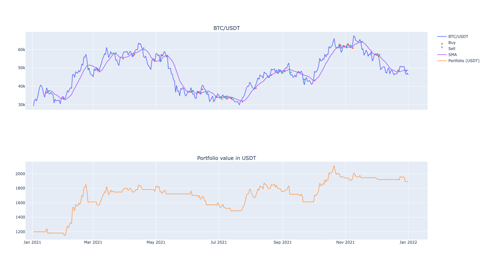

[](https://github.com/gbeced/basana/actions/workflows/runtests.yml)
[](https://badge.fury.io/py/basana)
[](https://basana.readthedocs.io/en/latest/)
[](https://opensource.org/licenses/Apache-2.0)
[](https://pepy.tech/project/basana)

# Basana

**Basana** is a Python **async and event driven** framework for **algorithmic trading**, with a focus on **crypto currencies**.

## Key Features

* Backtesting exchange so you can try your trading strategies before using real funds.
* Live trading at [Binance](https://www.binance.com/) and [Bitstamp](https://www.bitstamp.net/) crypto currency exchanges.
* Asynchronous I/O and event driven.

## Getting Started

### Installation

The examples use [TALIpp](https://github.com/nardew/talipp) for the technical indicators, so we need to install talipp as well.

```
$ pip install basana[charts] talipp
```

### Download historical data for backtesting

```
$ python -m basana.external.bitstamp.tools.download_bars -c BTC/USD -p 1d -s 2014-01-01 -e 2021-01-31 -o bitstamp_btcusd_day.csv
```

### Backtesting using SMA and market orders

```python
from decimal import Decimal
import asyncio
import logging

from talipp.indicators import SMA

from basana.backtesting import charts
from basana.external.bitstamp import csv
import basana as bs
import basana.backtesting.exchange as backtesting_exchange


# The strategy implements the set of rules that define when to enter or exit a trade based on market conditions.
class SMA_Strategy(bs.TradingSignalSource):
    def __init__(self, dispatcher: bs.EventDispatcher, period: int):
        super().__init__(dispatcher)
        self.sma = SMA(period)
        self._values = (None, None)

    async def on_bar_event(self, bar_event: bs.BarEvent):
        # Feed the technical indicator.
        value = float(bar_event.bar.close)
        self.sma.add_input_value(value)

        # Keep a small window of values to check if there is a crossover.
        self._values = (self._values[-1], value)

        # Is the indicator ready ?
        if len(self.sma) < 2:
            return

        # Price crossed below SMA ?
        if self._values[-2] >= self.sma[-2] and self._values[-1] < self.sma[-1]:
            self.push(bs.TradingSignal(bar_event.when, bs.OrderOperation.SELL, bar_event.bar.pair))
        # Price crossed above SMA ?
        elif self._values[-2] <= self.sma[-2] and self._values[-1] > self.sma[-1]:
            self.push(bs.TradingSignal(bar_event.when, bs.OrderOperation.BUY, bar_event.bar.pair))


# The position manager is responsible for executing trades and managing positions.
class PositionManager:
    def __init__(self, exchange: backtesting_exchange.Exchange, position_amount: Decimal):
        assert position_amount > 0
        self._exchange = exchange
        self._position_amount = position_amount

    async def on_trading_signal(self, trading_signal: bs.TradingSignal):
        logging.info("Trading signal: operation=%s pair=%s", trading_signal.operation, trading_signal.pair)
        try:
            # Calculate the order size.
            balances = await self._exchange.get_balances()
            if trading_signal.operation == bs.OrderOperation.BUY:
                _, ask = await self._exchange.get_bid_ask(trading_signal.pair)
                balance = balances[trading_signal.pair.quote_symbol]
                order_size = min(self._position_amount, balance.available) / ask
            else:
                balance = balances[trading_signal.pair.base_symbol]
                order_size = balance.available
            pair_info = await self._exchange.get_pair_info(trading_signal.pair)
            order_size = bs.truncate_decimal(order_size, pair_info.base_precision)
            if not order_size:
                return

            logging.info(
                "Creating %s market order for %s: amount=%s", trading_signal.operation, trading_signal.pair, order_size
            )
            await self._exchange.create_market_order(trading_signal.operation, trading_signal.pair, order_size)
        except Exception as e:
            logging.error(e)


async def main():
    logging.basicConfig(level=logging.INFO, format="[%(asctime)s %(levelname)s] %(message)s")

    event_dispatcher = bs.backtesting_dispatcher()
    pair = bs.Pair("BTC", "USD")
    exchange = backtesting_exchange.Exchange(
        event_dispatcher,
        initial_balances={"BTC": Decimal(0), "USD": Decimal(10000)}
    )
    exchange.set_pair_info(pair, bs.PairInfo(8, 2))

    # Connect the strategy to the bar events from the exchange.
    strategy = SMA_Strategy(event_dispatcher, 15)
    exchange.subscribe_to_bar_events(pair, strategy.on_bar_event)

    # Connect the position manager to the strategy signals.
    position_mgr = PositionManager(exchange, Decimal(1000))
    strategy.subscribe_to_trading_signals(position_mgr.on_trading_signal)

    # Load bars from CSV files.
    exchange.add_bar_source(csv.BarSource(pair, "bitstamp_btcusd_day.csv", "1d"))

    # Setup the chart.
    chart = charts.LineCharts(exchange)
    chart.add_pair(pair)
    chart.add_pair_indicator("SMA", pair, charts.DataPointFromSequence(strategy.sma))
    chart.add_portfolio_value("USD")

    # Run the backtest.
    await event_dispatcher.run()

    # Log balances.
    balances = await exchange.get_balances()
    for currency, balance in balances.items():
        logging.info("%s balance: %s", currency, balance.available)

    chart.show()

if __name__ == "__main__":
    asyncio.run(main())
```



The Basana repository comes with a number of [examples](./samples) you can experiment with or use as a template for your own projects.
Note that these are provided for educational purposes only. Use at your own risk.

## Documentation

[https://basana.readthedocs.io/en/latest/](https://basana.readthedocs.io/en/latest/)

## Help

You can seek help with using Basana in the discussion area on [GitHub](https://github.com/gbeced/basana/discussions).
