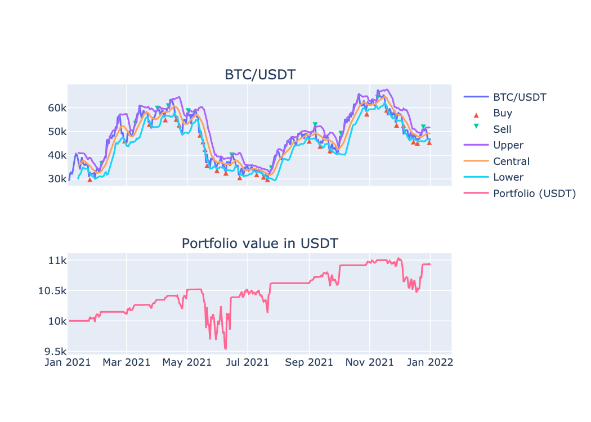

Quickstart
==========

Ready to get started ? This page gives a good introduction on how to get started with Basana.

.. _quickstart_installation:

Installation
------------

Basana requires Python 3.8.1 or above and to install the package you can use the following command:

.. code-block:: console

   (.venv) $ pip install basana[charts]

The `examples at GitHub <https://github.com/gbeced/basana/tree/master/samples>`_ take advantage of TALIpp, Pandas and statsmodels.
These can be installed using the following command:

.. code-block:: console

   (.venv) $ pip install talipp pandas statsmodels

.. _quickstart_backtesting:

Backtesting
-----------

All the examples that follow are structured like this:

* A trading **strategy** that implements the set of rules that define **when** to enter or exit a position based on market conditions.
  Strategies generate events, called trading signals, to notify a switch in position for one or more trading pairs.
* A **position manager** that is responsible for executing trades in response to trading signals generated by the strategy.
  The examples include a `backtesting position manager <https://github.com/gbeced/basana/blob/master/samples/backtesting/position_manager.py>`_
  and a `Binance position manager <https://github.com/gbeced/basana/blob/master/samples/binance/position_manager.py>`_.
  These position managers are using market orders to keep examples short, but you'll probably want to use limit orders when writing your
  own position managers.

.. note::
    **These examples are provided for educational purposes only. Use at your own risk, specially the live trading ones**.

    The way the examples are structured is just one way to do it. You're free to structure the code in any other way.

The strategy that we're going to use for backtesting is based on `Bollinger Bands <https://www.investopedia.com/articles/trading/07/bollinger.asp>`_
and the purpose of this example is just to give you an overview on how to connect the different pieces together.

The first thing we'll need in order to execute the backtest is historical data. Use the following command to download bars from Binance:

.. code-block:: console

    (.venv) $ python -m basana.external.binance.tools.download_bars -c BTC/USDT -p 1d -s 2021-01-01 -e 2021-12-31 -o binance_btcusdt_day.csv

There are two types of events taking place in this example:

* Bar (OHLC) events generated by the exchange.
* Trading signals generated by the strategy.

When a new bar is received by the strategy, a technical indicator will be fed using the bar's closing price. If the technical indicator
is ready, the strategy will check the values to determine if a switch in position should take place, and in that case a trading signal
will be pushed. 

When the trading signal is received by the position manager, a buy or sell market order will be submitted to the exchange in order to open
or close a position.

This is how all the pieces are put together:

.. literalinclude:: ../samples/backtest_bbands.py
   :language: python
   :lines: 39-68
   :dedent: 4

The full source code for this example can be found `here <https://github.com/gbeced/basana/tree/master/samples/backtest_bbands.py>`_,
and if you forked the repository, or at least downloaded the `samples <https://github.com/gbeced/basana/tree/master/samples>`_ folder,
you can execute the backtest using the following command:

.. code-block:: console

    (.venv) $ python -m samples.backtest_bbands

A chart similar to this one should open in a browser:

.. _quickstart_livetrading:

Live trading
------------

The strategy that we're going to use for live trading is the exact same one that we used for backtesting, but instead of using a backtesting
exchange we'll use `Binance <https://www.binance.com/>`_ crypto currency exchange.

.. literalinclude:: ../samples/binance_bbands.py
   :language: python
   :lines: 31-51
   :dedent: 4

.. note::
    These examples provided are for educational purposes only.

    **If you decide to execute them with real credentials you are doing that AT YOUR OWN RISK.**

You can start live trading using the following command:

.. code-block:: console

    (.venv) $ python -m samples.binance_bbands

Next steps
----------

The examples presented here, and many others, can be found at the
`examples folder at GitHub <https://github.com/gbeced/basana/tree/master/samples>`_.
